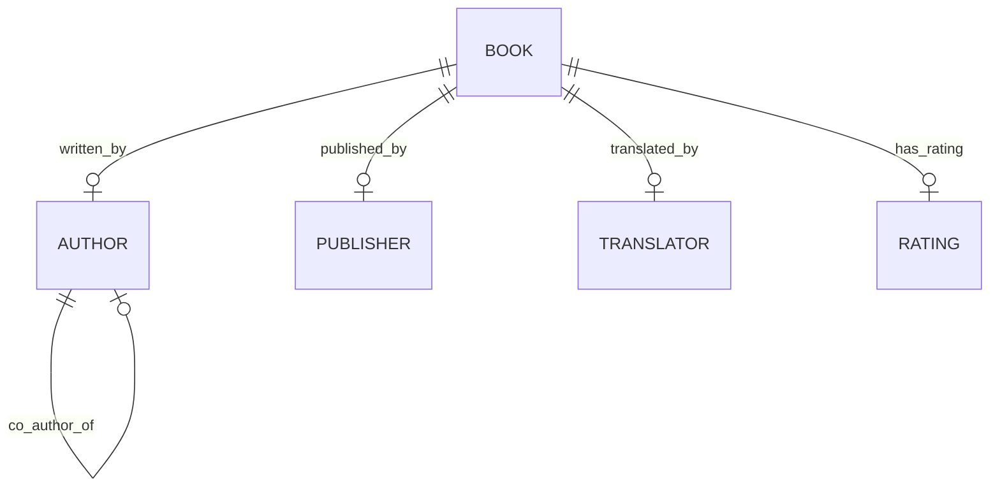
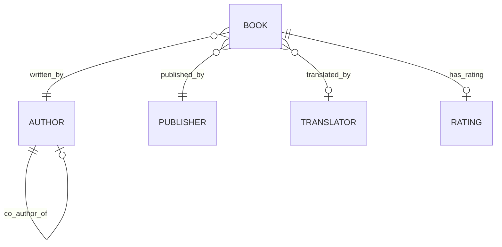
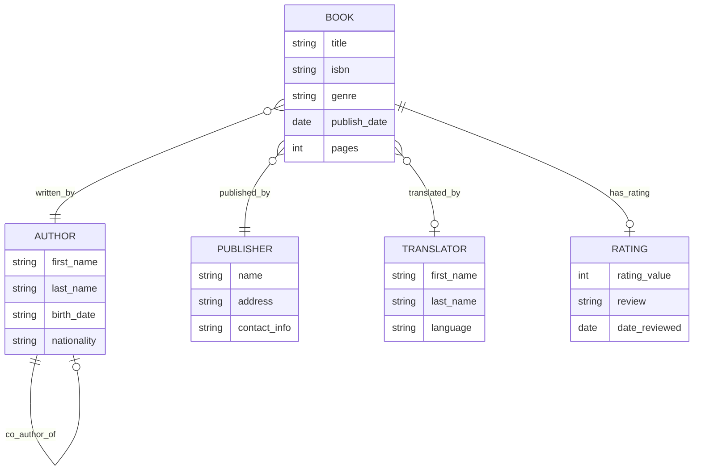

Databases can have multiple tables.
`sqlite longlist.db`
`.tables` is command used to view all the tables in the database.

When there are some relationship between these tables, we call them ***relational database***.
examples would be, Authors write books, publishers publish books, books are translated by translators.

The basic approach of organizing two or more tables can be using ***the honor system*** where the first row of one table will always correspond to the first row of another table. But there are possibility of mistakes in organizing it in this way.
***One table approach*** could solve this but can lead to redundancy (duplication of data) if there are one to many relationship between columns.


## Entity Relationship Diagram

One to one (author writes a book)
One to many (author writes many books)
Many to many (few authors together wrote many books)
These can be visualized using an entity relationship (ER) diagram.










Each table is an entry in our database.
The relationship between the tables or entities are represented by the **verbs** that mark the lines connecting entries.

Crow's foot notation.
The first line with zero on the line indicates that there are no relations.
Second one means it should at least have one row that relates to it in the other table.
Third with many branches means that the entity is related to many rows from another table.






One book is written by one author, also one author writes one book.


The author writes at least one book and a book is at least written by one author. The author could be associated with one or multiple books same for books.


For a translator, books do not need to have a translator so they could have zero or many translators so can be represented by the zero.


_______

## Keys
To relate tables to one another.

### Primary Keys

ISBN is a unique identifier given to all books to make it easy to search and identify.
Similarly, Primary key (like ISBN) is an identifier that is unique for every item in the table.
Each ID given within different tables (authors, books, publishers) would be the primary key of the table it belongs to.

### Foreign Keys

A foreign key is a primary key taken from a different table. By referencing the primary key of a different table, it helps relate the tables by forming a link between them.

  
Representing the many to many relationship using foreign keys in `authored` table that maps the primary keys of `books (book_id)` to the primary key of  `authors (author_id)`

The tables like `authored` are called joint or junction tables.


___

## Subqueries

A subquery is a query inside another query. also called nested queries which allows for making the queries more dynamic when many id or names have to be accessed.

```sql
SELECT "title"
FROM "books"
WHERE "publisher_id" = (
	SELECT "id"
	FROM "publishers"
	WHERE "publisher" = 'Fitzcarrlado Edition'
);
```
In this one to many relationship where a publisher has many books.
To find the title of the books from a publisher, we need the publisher id. To get the publisher_id we have to search for matching name in publishers table.

The subquery in the parentheses will be run first, or the deepest one will be. The indentation is just a styling convention.

To find rating of a book `in memory of memory`
```sql
SELECT "rating"
FROM "ratings"
WHERE "book_id" = (
	SELECT "id"
	FROM "books"
	WHERE "title" = 'In Memory of Memory'
);
```

Averaging the ratings by putting the rating in average
```sql
SELECT AVG("rating")
FROM "ratings"
WHERE "book_id" = (
	SELECT "id"
	FROM "books"
	WHERE "title" = 'In Memory of Memory'
);
```


For a many-to-many relationships where there is a join table which has just the ID, there will be many nested queries.
To find the author(s) of book Flights
```sql
SELECT "name"
FROM "authors"
WHERE "id" = (
	SELECT "author_id"
	FROM "authored"
	WHERE "book_id" = (
		SELECT "id"
		FROM "books"
		WHERE "title" = 'Flights'
	)
);
```


#### IN
This is the keyword used to check whether the desired `value` in `in` a given `set of values`.
The relationship between the authors and books is many to many. This means there can be one or more authors for a book.
To find the names of all the books written by an author, we would use `IN` keyword.
```sql
SELECT "title"
FROM "books"
WHERE "id" IN (
	SELECT "book_id"
	FROM "authored"
	WHERE "author_id" = (
		SELECT "id"
		FROM "authors"
		WHERE "name" = 'Fernanda Melchor'
	)
);
```
Innermost query uses `=` because we want to find the author by his name.
`IN` is used as the `authored` table might give many `book_id` as a set.
So searching `In` that to find all the id if they are present in `books`.


____

## JOIN
This allows to combine two or more tables together.

We can join the tables using a common factor between the two tables (like id) to ensure correct rows are lined up against each other.



To join these two tables:
```sql
SELECT *
FROM "sea_lions"
JOIN "migrations" ON "migrations"."id" = "sea_lions"."id";
```
The `ON` keyword is used to specify which values match between the tables being joined. (there is no way to join tables without matching values).

***INNER JOIN***
Inner join happens when there is an id in one table which isn't present in another table so these rows will get removed from the joined table.
Only the rows which have their id match will be present. like the example above where just the `JOIN`...`ON` is used is an inner join. 

***OUTER JOIN***
This allows for some data which doesn't match also to be kept. leading to `NULL` values when joined.

`LEFT JOIN` prioritize the data in the left (first) table.(keeps all the rows from first table)
`RIGHT JOIN` prioritize the data in the right(second) table and keeps all rows of second table.
`FULL JOIN` allows to see the entries of all the tables.


```sql
SELECT *
FROM "sea_lions"
LEFT JOIN "migrations" ON "migrations"."id" = "sea_lions"."id";
```

`NATURAL JOIN`
If the values on which we are joining the two tables have the same column name in both tables, we can omit the `ON` section.
This will be an `INNER JOIN` and also there will be no duplicate ID columns.
```sql
SELECT *
FROM "sea_lions"
NATURAL JOIN "migrations";
```


____

## Sets

On running a query, the results we see are called `result set`, which is a kind of set in SQL.

##### INTERSECT
Intersection of two sets (author, translator) when a person is in both.
This can be done by using `INTERSECT` operations.
```sql
SELECT "name" FROM "translators"
INTERSECT
SELECT "name" FROM "authors";
```



##### UNION
If a person is either an author or translator or both, then they belong to the union of the two sets.
So every author and translator is included but only once in this result.
```sql
SELECT "name" FROM "translators"
UNION
SELECT "name" FROM "authors";
```


To get profession of person in result,
```sql
SELECT 'author' AS "profession", "name"
FROM "authors"
UNION
SELECT 'translator' AS "profession", "name"
FROM "translators";
```

##### EXCEPT
Everyone who is only an author using `EXCEPT`.
Which means the set of translators is subtracted from authors.
```sql
SELECT "name" FROM "authors"
EXCEPT
SELECT "name" FROM "translators";
```




#### INTERSECT
To find people who are either authors or translators but not both.



These are useful to answer many different questions.
Each nested query finds the ID's of the books for one translator.
The `INTERSECT` is used to intersect the resulting two sets to give the books both have collaborated on.

```sql
SELECT "books_id" FROM "translated"
WHERE "translator_id" = (
	SELECT "id" FROM "translators"
	WHERE "name" = 'Sophie'
)
INTERSECT
SELECT "books_id" FROM "translated"
WHERE "translator_id" = (
	SELECT "id" FROM "translators"
	WHERE "name" = 'Margaret'
);
```

We have to make sure to have same number and type of columns in the sets to be combined using `INTERSECT` `UNION` etc


## Groups

We want to find the average rating if the book.
First need the group ratings together by the book and then average the ratings out for each books(each group)
```sql
SELECT "book_id", AVG("rating") AS "average ratings"
FROM "ratings"
GROUP BY "book_id";
```
In this query, `GROUP By` was used to create groups for each book and then collapse the ratings of the group into an average rating!

To see the books that are rated with average rating of over 4.
```sql
SELECT "book_id", ROUND(AVG("rating"), 2) AS "average rating"
FROM "ratings"
GROUP BY "book_id"
HAVING "average rating" > 4.0;
```
`HAVING` is used here to specify a condition for the groups, instead of `WHERE` (which specifies conditions for individual rows) 

Ordering the books according the the rating
```sql
SELECT "book_id", ROUND(AVG("rating"), 2) AS "average rating"
FROM "ratings"
GROUP BY "book_id"
HAVING "average rating" > 4.0
ORDERE BY "average rating" DESC;
```


To get the number of rating for each book
```sql
SELECT "book_id", COUNT("rating")
FROM "ratings"
GROUP BY "book_id";
```

